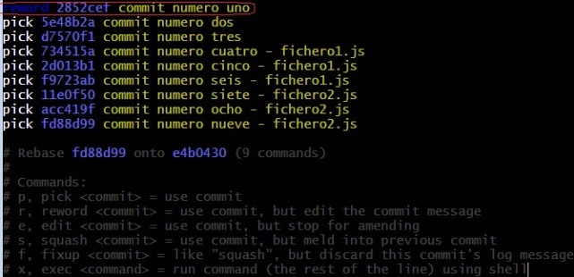
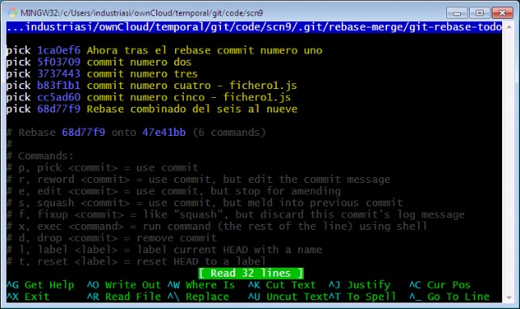

# 4. Flujos de trabajo 58m
   * Experimentando con ramas (Parte I) 6:24 
   * Experimentando con ramas (Parte II) 3:36 
   * Experimentando con ramas (Parte III) 3:25 
   * Encontrando errores 9:34 
   * Git Blame 4:39 
   * Siendo "quisquilloso" con Git 6:37 
   * Reescribir la historia de un proyecto con Rebase 7:28 
   * Etiquetas 5:13 
   * Moverse adelante y atrás entre estados de un repositorio git 7:43 
   * Git Stash 3:46 
   * Contenido adicional 6
   
## Experimentando con ramas (Parte I) 6:24

[Experimentando con ramas](pdfs/Experimentando_con_ramas.pdf)

En esta lección aprenderemos cómo podemos crear ramas en nuestro repositorio. Una rama (*branch*) permite trabajar, de forma efectiva, en un *working directory* completamente nuevo. El resultado es que un único repositorio Git puede tener múltiples versiones diferentes del código base, entre las cuales podemos intercambiarnos sin movernos de directorio.

La rama por defecto en Git se llama *master*. Las ramas adicionales permiten llevar a cabo las mismas operaciones y comandos que podrías efectuar en la rama *master*, como cambios de tipo *committing*, *merging* y *pushing*.

Como ramas adicionales, funcionan de la misma manera que *master* y son ideales para prototipado y experimentos o pruebas que permiten ser fusionadas a la rama *master* si se decide así.

Cuando conmutamos o nos cambiamos de rama, Git cambia los contenidos del *working directory*. Esto es muy llamativo y sorprendente las primeras veces que lo usamos. Usando esta funcionalidad, no necesitamos cambiar configuraciones o parámetros para reflejar que estamos en ramas o ubicaciones diferentes.

### Paso 1 - Git Branch

Las ramas se crean basándonos en otra rama, generalmente *master*. El comando:

```sh
git branch <new_branch> <starting_branch>
```

toma una rama existente y crea una rama separada para trabajar en ella. Justo en el punto de lanzar el comando, las dos ramas son idénticas. Para cambiar de una rama a otra, usamos el comando:

```sh
git branch <new_branch>
```

#### Tarea

Creamos un nuevo repositorio y lo inicializamos.

Vamos a gitlab, creamos un nuevo proyecto de tipo privado, y lo inicializamos con un README.md automático.

Agregamos el origin de nuestro proyecto gitlab y lo descargamos a nuestro master.

Creamos una nueva rama réplica y la llamamos “new_branch”.

Nos cambiamos a ella.

#### Avanzado

El comando *git checkout -b* creará y hará *checkout* de la nueva rama creada; es decir, es lo mismo que un *git branch + git checkout*

### Paso 2 – Listar las ramas

Para listar todas las ramas usamos el comando *git branch*.

El argumento adicional *-a* incluirá también las ramas remotas, y el parámetro *-v* incluirá el mensaje *commit* de HEAD de la rama. Recomendable usar ambos siempre.

#### Tarea

Usando la carpeta de proyecto del paso anterior, listar todas las ramas con su último mensaje de *commit* lanzando *git branch*

### Paso 3 – Hacer fusión (merge) a master

Supongamos que se ha producido un *commit* a una nueva rama. Para fusionar (*merge*) dentro de la rama *master*, deberíamos primero hacer *chekout* a la rama objetivo (posicionarnos sobre ella), en este caso master, y estando en ella, lanzar un *git merge* para fusionar los cambios de la nueva rama sobre la rama *master*.

Ejemplo de llamada:

```sh
git merge rama_origen rama_destino_del_merge
```

#### Tarea

Usando la carpeta de proyecto de nuestro ejercicio anterior, hacemos checkout a new_branch.

Modifico el archivo README.md, lo llevo a staging y lo apruebo.

Ahora, me cambio a master y fusiono.

Compruebo los cambios. Los apruebo.

### Paso 4 - Push Branches

Tal y como hemos visto en pasos anteriores, si queremos subir el contenido de una rama a una ubicación remota, tenemos que usar el comando:

```sh
git push <remote_name> <branch_name>
```

Ejemplo:

```sh
$ git push origin master
warning: redirecting to https://gitlab.com/juancarlos.rubio/ej06-branches.git/
Enumerating objects: 5, done.
Counting objects: 100% (5/5), done.
Delta compression using up to 2 threads.
Compressing objects: 100% (2/2), done.
Writing objects: 100% (3/3), 340 bytes | 340.00 KiB/s, done.
Total 3 (delta 0), reused 0 (delta 0)
To https://gitlab.com/juancarlos.rubio/ej06-branches
   14a0d49..31980bc  master -> master
```

#### Tarea

Trabajar en una carpeta de proyecto y subir cambios a gitlab. Comprobar que se suben correctamente.

### Paso 5 – Limpiar ramas

Limpiar ramas es importante para borrar ruido y confusión en un proyecto. Para borrar una rama se necesita usar el argumento *-d*. Por ejemplo:

```sh
git branch -d <branch_name>
```

#### Tarea

Ahora que hemos fusionado la rama en *master* en el paso anterior, ya no nos hace falta. Borrémosla para mantener el repositorio limpio y comprensible.

## Experimentando con ramas (Parte II) 3:36 

## Experimentando con ramas (Parte III) 3:25 

## Encontrando errores 9:34 

[Encontrando errores](pdfs/Encontrando_errores.pdf)

Los errores de software o bugs han constituido un problema desde que existe el software. Puesto que Git guarda todos los cambios en el repositorio, se convierte en una gran fuente de información y en una herramienta de diagnóstico cuando tratamos de identificar cómo llegaron a introducirse los problemas de código.

En esta lección exploraremos diferentes formas para encontrar en cuál commit se introdujo un determinado problema.

### Paso 1 - Git Diff entre dos Commits

El comando *git diff* es el modo más simple de comparar qué ha cambiado entre commits. Mostrará las diferencias entre dos commits.

##### Ejemplo:

Podemos visualizar las diferencias entre dos *commits* visualizando los *hash-id’s*

```sh
$ git diff HEAD~2 HEAD
diff --git a/README.md b/README.md
index 77927c0..c8831b2 100644
--- a/README.md
+++ b/README.md
@@ -1,2 +1,3 @@
 # ej06-branches

+## Y agrego este subtitulo al fichero README.md
diff --git a/codigo.js b/codigo.js
new file mode 100644
index 0000000..cac68b2
--- /dev/null
+++ b/codigo.js
@@ -0,0 +1 @@
+mas codigo
```

Posibilidades comunes:

**git diff** muestra las diferencias entre el *working directory* y el *commit*. En este caso, el commit es HEAD, así que mostraría los cambios que hemos hecho desde nuestro último *commit*. Incluyendo los ficheros *untracked* o los ficheros *unstaged*, es decir, nuestro working directory.

**git diff —cached** muestra las diferencias solo entre nuestro *staged changes* y el estado almacenado en él. Es decir, que si no he hecho “git add” a ciertos ficheros que haya modificado, no se analizan las diferencias entre ellos y el *commit*.

### Paso 2 - Git Log

El comando *git log* permite ver los mensajes de *commit* pero por defecto no muestra una salida de lo que en realidad se modificó. Afortunadamente, el comando es extremadamente flexible y permite opciones adicionales que proporcionan visualizaciones útiles de lo sucedido en el histórico del repositorio.

#### Ejemplos:

Para ver una introducción o entradilla de información de los *commits* en una vista reducida, podemos usar el comando git log —oneline

La salida de información del *commit* con las diferencias que se hayan producido se puede lograr agregando el parámetro *-p* , lanzándolo así: git log -p

Esto mostraría todo el repositorio al completo… Demasiada información. Podemos delimitar un poco usando otro parámetro: *-n* . Con él, especificamos un límite de *commits* a mostrar desde HEAD.

Por ejemplo; el comando:

```sh
git log -p -n 2
```

mostraría HEAD y HEAD~1.

Si conocemos el periodo de tiempo o fechas que queremos consultar (útil para localizar versiones con garantías de estar libres de fallos, por ejemplo) podemos usar:

```sh
 *--since="2 weeks ago"* y --until="1 day ago".
``` 

(admite *“1 hour ago”* y otras variantes en inglés).

Y como en otros comandos Git, podemos obtener un rango de salida de *commits* usando intervalos como por ejemplo HEAD…HEAD~1

Podemos localizar patrones en el asunto del *commit* con el parámetro *grep*:

Ejemplo:

```sh
git log --grep="Initial"
```

mostraría la salida de commits que incluyesen la cadena “Initial” en su mensaje. También podemos usar un pipeline y redirigirlo al comando unix *grep* normalmente. Esto puede ser muy útil cuando tratamos de localizar números de registro de bug (*bug-tracking numbers*).

#### Avanzado

Tal y como hemos visto, el log puede ser ruidoso. Probemos las posibilidades del comando *git log* agregándole el parámetro *-m* y juguemos con las consultas para obtener resultados deseados.

### Paso 3 - Git Blame

Disponer de una cultura de “culpa” (*blame*) no es deseable, aunque puede ser útil para conocer quién trabajó en ciertas secciones del fichero para ayudar a realizar mejoras en el futuro.

En estas circunstancias es donde *git blame* puede ser de utilidad.

git blame muestra la revisión y el autor que modificó cada línea de un fichero.

##### Ejemplo:

Lanzar *git blame* sobre un fichero mostrará quién tocó cada línea.

```sh
git blame list.html
```

Y si conocemos las líneas que pueden estar afectadas, podemos filtrar el rango de líneas de salida:

```sh
git blame -L 6,8 list.html
industriasi@alvarez MINGW32 ~/ownCloud/temporal/git/code/ej06-branches (maste
$ git blame README.md
^14a0d49 (Juan Carlos Rubio 2018-09-06 16:38:29 +0000 1) # ej06-branches
^14a0d49 (Juan Carlos Rubio 2018-09-06 16:38:29 +0000 2)
31980bcd (Juan Carlos Rubio 2018-09-06 19:00:02 +0200 3) ## Y agrego este subtitulo al fichero README.md
```

#### Tarea

Probemos la ejecución y las posibilidades de estas herramientas.

Creamos un nuevo proyecto. Inicializamos. Nos vinculamos a https://github.com/sharkdp/bat

Hacemos pull. Buscamos logar los últimos 15 cambios.

Lanzamos *blame* sobre el fichero *src/output.rs*

## Git Blame 4:39 

## Siendo "quisquilloso" con Git 6:37 

[Siendo "quisquilloso" con Git ](pdfs/Siendo_quisquillosos_con_GIT.pdf)

Una de las ventajas de pequeños `commits` es que podemos ser quisquillosos y detallistas acerca que cuáles de esos commits queremos unir / *merge*.

Este problema afecta particularmente a las ramas de larga vida, que se han convertido en obsoletas con una rama que tiene demasiados conflictos para hacer *merge*. Esto sucede de forma frecuente en muchos proyectos activos de *open source*.

Cuando esto sucede, queremos ser capaces de picotear *commits* individuales y simplemente hacer *merge* de ellos en la rama principal. Veremos cómo hacerlo.

### Paso 1 – Resolviendo un conflicto de Cherry Picking

De igual forma que hacer un *merging* puede resultar en un conflicto, también puede producirse en un “entresacado” o “picoteo” (*cherry-pick*). Los conflictos se solucionan de la misma forma que fusionando una rama bien reparando manualmente los ficheros o bien seleccionando *theirs* o seleccionando *ours* a través del comando *git checkout*.

Si nos damos cuenta de que hemos cometido un error, podemos parar y revertir lo que hemos hecho lanzando:

```sh
 git cherry-pick --abort
```

Imaginemos que lanzamos un *cherry-pick* ejecutando por ejemplo:

```sh
git cherry-pick new_branch~1
```

Si este comando resultase en un conflicto de *merge*, se puede resolver usando el comando git checkout y seleccionando el *commit* elegido cuidadosamente (*picked*).

### Paso 2 - Continuando un Cherry Picking después de un conflicto

Una vez que los conflictos se han resuelto, se puede continuar con el *cherry-pick* usando el comando

```sh
git cherry-pick --continue
```

De forma similar a *merge*, resolver un *cherry-pick* puede resultar en un *commit*.

#### Tarea

En este caso, trabajaremos conjuntamente el ejercicio para comprobar las posibilidades del comando *cherry-pick* .

En esta lección, vamos a tratar de tomar parte del árbol del proyecto BAT y en lugar de hacer un pull completo (como un clone), nos vamos a traer dos porciones de modificaciones y las vamos a agregar con merge desmenuzado con *cherry-pick*.

## Reescribir la historia de un proyecto con Rebase 7:28 

[Reescribir la historia de un proyecto con Rebase ](pdfs/Reescribiendo_la_historia_con_GIT.pdf)

Un aspecto importante de Git es cómo mantener limpio el repositorio y su historia. Una historia limpia es más cómoda para trabajar y para comprender qué ha sucedido.

En esta lección cubriremos cómo reescribir la historia de Git usando el comando *rebase* para reestructurar los *commits* y asegurarnos de que son comprensibles antes de subir /*push* los cambios.

**Recomendación**: Solo deberíamos hacer *rebase* de *commits* que no hayamos compartido con otras personas vía *push*. El proceso de *rebasing* de *commits* provoca que los hash_id *commit-ids* cambien, lo cual puede resultar en pérdida de *commits* futuros.

### Paso 1 - Enmendando (*amend*) *mensajes* de commit

Para reescribir el histórico de los repositorios, usamos el comando:

```sh
git rebase -interactive
```

Al poner un *rebase* en modo interactivo, tenemos más control sobre los cambios que queremos hacer. Después de lanzar el modo interactivo, disponemos de 6 comandos para llevar a cabo en cada *commit* del repositorio. Usando el editor, podemos definir qué acciones queremos llevar a cabo en cada *commit*.

En este ejercicio, vamos a cambiar el comentario de un *commit*. Tras ponerlo en estado *rebase*, tendremos que cambiar la palabra *pick* por la palabra *reword* para el identificador de commit para el que queramos cambiar la descripción.

En esta lección, solo vamos a cambiar la descripción. Ejemplo:



#### Tarea

Para este ejercicio, vamos a crear un nuevo repositorio.

Crearemos 9 ficheros, y tras la creación de cada uno, haremos un commit y agregaremos un texto inequívoco que nos sirva como descriptor.

Para empezar el *rebase* lanzamos:

```sh
git rebase --interactive --root
```

Entrando en “Interactive Mode”

Una vez que estemos en la pantalla de la ilustración anterior, cambiaremos la palabra *“pick“* del primer *commit* de la lista por la palabra *“reword“*.

Grabamos

Cambiando el mensaje

Ahora cambiamos el mensaje por lo que queramos. Grabamos y salimos.

Lanzamos el comando:

```sh
git log --oneline
```

para comprobar que se ha actualizado el mensaje.

#### Avanzado

El argumento *—root* permite hacer un *rebase* de TODOS los commits del repositorio, incluyendo el *primer commit*.

Cuando lo que queremos es únicamente cambiar el mensaje del último commit realizado, la alternativa más rápida es lanzar el comando:

```sh
git commit --amend
```

y efectuar los cambios.

### Paso 2 - Aprobaciones condensadas (Squash Commits)

Hemos realizado una serie de commits en nuestro entorno. En el momento en el que se hicieron, quizás esos cambios tenían sentido como operaciones independientes, pero ahora necesitamos condensarlos en un único commit.

Usando *rebase* podemos condensar (*squash*) los *commits* todos juntos.

Lanzando git rebase —interactive HEAD~4, tendremos 4 commits disponibles. Para condensarlo, necesitamos una base sobre la que todo será condensado. Por ello, en el ejercicio siguiente, dejamos el primer *commit* como *pick* y marcamos los demás como *squash*. Después de guardar, podremos cambiar el mensaje de commit por algo más clarificador.

#### Tarea

Cuando entramos en modo *interactive rebase* podemos especificar lo que queremos modificar en los 4 previos commits. Lanzamos:

```sh
git rebase --interactive HEAD~4
```

En el ejercicio anterior usamos *reword*. Aquí vamos a usar *squash*. Queremos condensar 4 commits en uno; si etiquetáramos todos los commits como squash, obtendríamos un error: *“Cannot ‘squash’ without a previous commit“* ya que se supone que debe existir un commit base sobre el que condensar los demás.

Para condensar los commits tenemos que dejar el primer commit (el más antiguo temporalmente) como nuestra base, y etiquetar el resto con *squash*.

#### Mensaje de commit

Al salvar y salir se mostrará una ventana con una combinación de los cuatro mensajes de commit en el *rebase*.

Después de guardar el mensaje de commit, el histórico se modificará. Podemos comprobar que el hasid no coincide lanzando:

```sh
git log --oneline
```

### Reordenar commits

Reordenar commits puede ayudar a construir una foto más clara del orden lógico cómo se ha completado lo que hemos trabajado.

#### Tarea

Queremos reordenar nuestros últimos dos commits. Usando HEAD~2 podremos hacerlo:

```sh
git rebase --interactive HEAD~2
```

Usando el editor, simplemente reordenaremos las líneas, guardaremos y saldremos y los commits reflejarán el nuevo orden.

Aquí tenemos una ilustración:




```sh
$ git log --oneline
3254464 (HEAD -> master) Rebase combinado del seis al nueve
c58f563 commit numero cinco - fichero1.js
25cd399 commit numero tres
b7f8abc commit numero cuatro - fichero1.js
5f03709 commit numero dos
1ca0ef6 Ahora tras el rebase commit numero uno
```

### Paso 3 - Separar los commits (split)

Del mismo modo que cuando se condensan los commits, a veces es útil separar o desmenuzar los commits con el objeto de mantener la atención y posibilitar un *cherry-pick* o un *revert* más sencillo.

Separar los commits es un proceso de dos fases. Primero necesitamos definir qué commit queremos dividir o separar, y segundo, necesitamos definir cómo queremos que se muestren los nuevos *commits*.

Definiendo el *commit* que separar (*split*)

Aquí queremos separar el commit anterior. Lanzamos:

```sh
git rebase --interactive HEAD~1
```

Como en *rebase’s* previos, necesitamos cambiar la tarea al término *edit*

Ahora estamos en un estado de edición interactiva del histórico. Git grabará todos los cambios y el resultado final será aplicado al repositorio.

Separando commits

Después de definir que queremos *editar* el commit, nos encontramos en un estado que nos permite cambiar el histórico (estamos en modo interactivo y finalizaremos la “grabación” de acciones con un —*continue*)

1. Como queremos separar un commmit existente, primero necesitamos borrarlo lanzando el comando: git reset HEAD~1.

2. El commit ha sido borrado pero aún existe. Ahora podemos llevar a cabo los commits como deseamos, es decir, como dos acciones separadas.

Ejecutamos los siguientes comandos:

```sh
git add file3.txt
git commit -m "File 3"
git add file4.txt
git commit -m "File 4"
```

Guardando “la grabación” del *rebase*

Una vez que estamos felices con el estado del repositorio, y conformes, podemos decirle a git que continúe el rebase y que actualice el repositorio lanzando el comando:

```sh
git rebase --continue
```

Podemos visualizar la salida y los dos nuevos commits con el comando:

```sh
git log --oneline
```

La capacidad de reescribir el histórico es útil para mantener el histórico del repositorio limpio y preciso. Esto ayudará en el futuro para indicar las razones para un cambio o para depurar problemas de código.

#### Recomendación

Solo deberíamos hacer un *rebase* en commits que no hayamos compartido con otras personas vía push. El *rebasing* causa que los identificadores de commit cambien, lo que puede desembocar en pérdida de commits futuros.

## Etiquetas 5:13 

[Etiquetas](pdfs/Etiquitas.pdf)

Como muchos VCS, Git tiene la posibilidad de etiquetar puntos específicos del historial como importantes. Esta funcionalidad se usa típicamente para marcar versiones de lanzamiento (v1.0, por ejemplo). En esta sección, aprenderás como listar las etiquetas disponibles, como crear nuevas etiquetas cuales son los distintos tipos de etiquetas. En esta lección aprenderemos cómo trabajar con ellas.

### Paso 4 - Listar Tus Etiquetas

Listar las etiquetas disponibles en Git es sencillo. Simplemente escribe git tag:

```sh
$ git tag
v0.1
v1.3
```

Este comando lista las etiquetas en orden alfabético; el orden en el que aparecen no tiene mayor importancia.

También puedes buscar etiquetas con un patrón particular. El repositorio del código fuente de Git, por ejemplo, contiene más de 500 etiquetas. Si solo te interesa ver la serie 1.8.5, puedes ejecutar:

```sh
$ git tag -l 'v1.8.5*'
v1.8.5
v1.8.5-rc0
v1.8.5-rc1
v1.8.5-rc2
v1.8.5-rc3
v1.8.5.1
v1.8.5.2
v1.8.5.3
v1.8.5.4
v1.8.5.5
```

### Paso 5 - Crear Etiquetas

Git utiliza dos tipos principales de etiquetas: ligeras y anotadas. Una etiqueta ligera es muy parecido a una rama que no cambia - simplemente es un puntero a un *commit* especifico.

Sin embargo, las etiquetas anotadas se guardan en la base de datos de Git como objetos enteros.

Tienen un *checksum*; contienen el nombre del etiquetador, correo electrónico y fecha; tienen un mensaje asociado; y pueden ser firmadas y verificadas con *GNU Privacy Guard* (GPG). Normalmente se recomienda que crees etiquetas anotadas, de manera que tengas toda esta información; pero si quieres una etiqueta temporal o por alguna razón no estas interesado en esa información, entonces puedes usar las etiquetas ligeras.

### Paso 6 - Etiquetas Anotadas

Crear una etiqueta anotada en Git es sencillo. La forma más fácil de hacer es especificar la opción -a cuando ejecutas el comando tag:

```sh
$ git tag -a v1.4 -m 'my version 1.4'
$ git tag
v0.1
v1.3
v1.4
```

La opción -m especifica el mensaje de la etiqueta, el cual es guardado junto con ella. Si no especificas el mensaje de una etiqueta anotada, Git abrirá el editor de texto para que lo escribas.

Puedes ver la información de la etiqueta junto con el *commit* que está etiquetado al usar el comando git show:

```sh
$ git show v1.4
tag v1.4
Tagger: Ben Straub <ben@straub.cc>
Date: Sat May 3 20:19:12 2014 -0700
my version 1.4
commit ca82a6dff817ec66f44342007202690a93763949
Author: Scott Chacon <schacon@gee-mail.com>
Date: Mon Mar 17 21:52:11 2008 -0700
changed the version number
```

El comando muestra la información del etiquetador, la fecha en la que el commit fue etiquetado y el mensaje de la etiquetar, antes de mostrar la información del *commit*.

### Paso 7 - Etiquetas Ligeras

La otra forma de etiquetar un *commit* es mediante una etiqueta ligera. Una etiqueta ligera no es más que el *checksum* de un *commit* guardado en un archivo - no incluye más información. Para crear una etiqueta ligera, no pases las opciones -a, -s ni -m:

```sh
$ git tag v1.4-lw
$ git tag
v0.1
v1.3
v1.4
v1.4-lw
v1.5
```

Esta vez, si ejecutas git show sobre la etiqueta, no veras la información adicional. El comando solo mostrará el commit:

```sh
$ git show v1.4-lw
commit ca82a6dff817ec66f44342007202690a93763949
Author: Scott Chacon <schacon@gee-mail.com>
Date: Mon Mar 17 21:52:11 2008 -0700
changed the version number
```

## Moverse adelante y atrás entre estados de un repositorio git 7:43 

[Moverse adelante y atrás entre estados de un repositorio git](pdfs/Moverse_adelante_y_atrás_entre_estados_de_un_repositorio_git.pdf)

Con el comando:

```sh
git checkout <hash-id>
```

Entramos en modo desconectado, pero tenemos una foto idéntica a la que teníamos en ese instante del tiempo.

En **subversion** hubiera sido con el comando:

```sh
svn up -r800
```
(suponiendo la versión 800)

Para volver al HEAD, escribimos:

```sh
git checkout master
```

o bien

```sh
git checkout -
```

(un único guion al final del comando).

#### Tarea:

Movernos al commit inicial y al HEAD y comprobar cómo los ficheros aparecen y desaparecen

#### Nota:

git stash guarda el estado que tengamos en ese momento sin aprobar o en staged.

Se recupera con:

```sh
git stash apply
```

## Git Stash 3:46 

## Contenido adicional 6   
